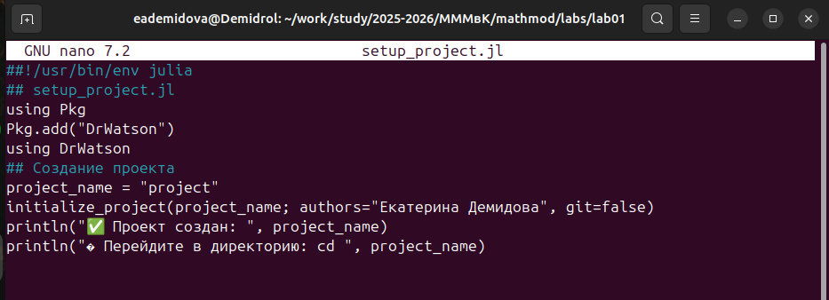
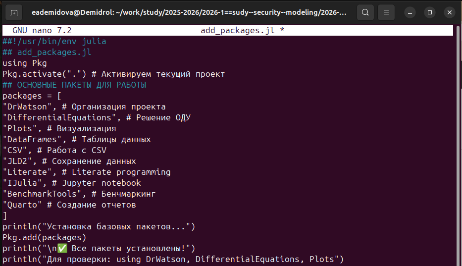
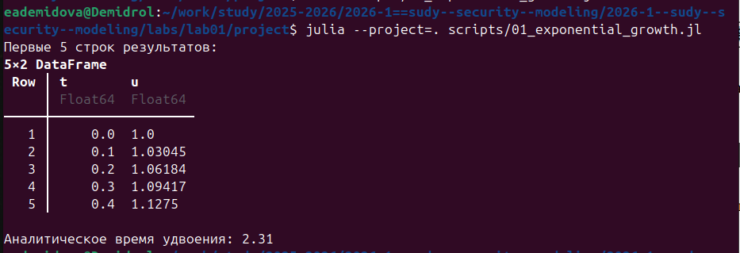
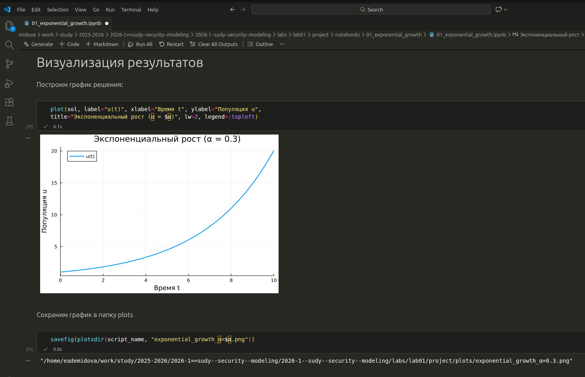
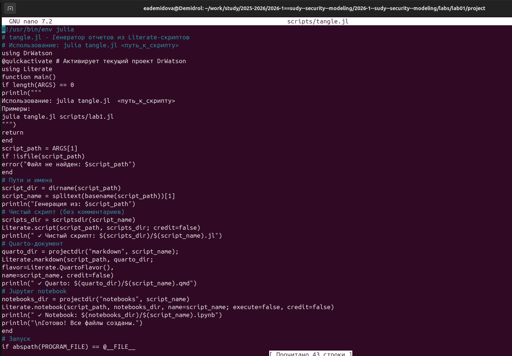

---
# Preamble

## Author
author:
  name: Демидова Екатерина Алексеевна
  degrees: BSc
  orcid: 0009-0005-2255-4025
  email: 1032259377@pfur.ru
  affiliation:
    - name: Российский университет дружбы народов
      country: Российская Федерация
      postal-code: 117198
      city: Москва
      address: ул. Миклухо-Маклая, д. 6
## Title
title: "Лабораторная работа №1"
subtitle: "Основы литературного программирования"
license: "CC BY"
date: 2026-17-02
## Generic options
lang: ru-RU
crossref:
  lof-title: Список иллюстраций
  lot-title: Список таблиц
  lol-title: Листинги
## Formats
format:
### Pdf output format
  beamer:
    toc: false
    toc-title: Содержание
    number-sections: true
    colorlinks: false
    toc-depth: 2
    slide_level: 2
    aspectratio: 169
    section-titles: true
    theme: metropolis
    themeoptions: progressbar=frametitle,sectionpage=progressbar,numbering=fraction
#### Language
    babel-lang: russian
    babel-otherlangs: english
### Html output
  revealjs:
    transition: slide
    margin: 0.2
    smaller: false
    output-ext: html
    theme: beige
    logo: _resources/image/logo_rudn.png
---

# Информация

## Докладчик

:::::::::::::: {.columns align=center}
::: {.column width="70%"}

  * Демидова Екатерина Алексеевна
  * студентка группы НФИмд-01-25
  * Российский университет дружбы народов
  * <https://github.com/eademidova>

:::
::: {.column width="30%"}

:::
::::::::::::::

# Введение

# Цель работы

Освоение методологии литературного программирования: создание самодокументируемого кода, его компиляция в исполняемые файлы (чистый код, Jupyter Notebook) и генерация технической документации (Quarto) с возможностью параметризации вычислений.

# Задачи

- Выполнить предложенный код и преобразовать код в литературный стиль.
- Сгенерировать из литературного кода:
- чистый код;
- jupyter notebook;
- документацию в формате Quarto.
- Выполнить код из jupyter notebook.
- Интегрировать документацию в формате Quarto в отчёт.
- Добавить в код в литературном стиле вычисление для набора параметров.

# Подготовка проекта

{#fig-001 width=40%}

# Подготовка проекта

{#fig-002 width=70%}

# Подготовка проекта

{#fig-003 width=70%}

# Подготовка проекта

{#fig-004 width=70%}

# Подготовка проекта

{#fig-005 width=70%}

# Моделирование экспоненциального роста

{#fig-006 width=70%}

# Моделирование экспоненциального роста

{#fig-007 width=70%}

# Моделирование экспоненциального роста

{#fig-008 width=70%}

# Моделирование экспоненциального роста

{#fig-009 width=70%}

# Моделирование экспоненциального роста

{#fig-010 width=70%}

# Моделирование экспоненциального роста

{#fig-011 width=70%}

# Выводы

1. Сформирована структура рабочего пространства, обеспечивающая разделение исходных кодов, данных и документации.  
2. Выполнена интеграция вычислительных экспериментов с их описанием за счёт преобразования кода в литературный стиль.  
3. Автоматизирована генерация артефактов (чистый код, Notebook, отчёт Quarto), что повышает воспроизводимость исследования.  
4. Реализована параметризация расчётов, позволяющая гибко изменять входные данные без модификации основной логики программы.  
5. Итоговая документация объединяет код, результаты вычислений и аналитические выводы, соответствуя принципам открытой науки.

# Список литературы

1. JuliaLang [Электронный ресурс]. 2024 JuliaLang.org contributors. URL: https: //julialang.org/ (дата обращения: 11.10.2024).
2. Julia 1.11 Documentation [Электронный ресурс]. 2024 JuliaLang.org contributors. URL: https://docs.julialang.org/en/v1/ (дата обращения: 11.10.2024).
3. Самарский А. А., Михайлов А. П. Математическое моделировамоделирование: Идеи. Методы. Примеры... — М.: Физматлит, 2001.. — 320 с. — ISBN 5-9221-0120-Х.