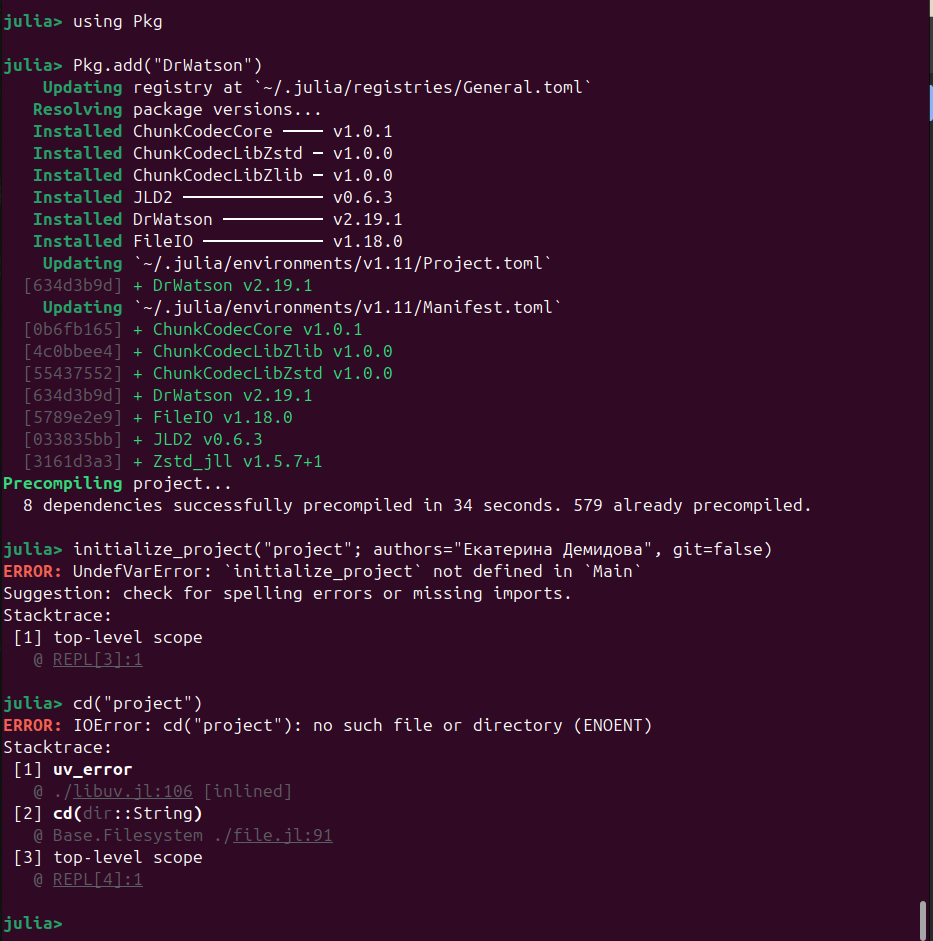
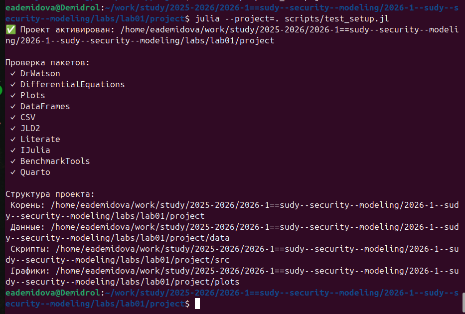
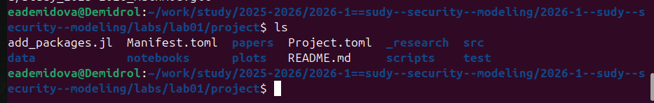
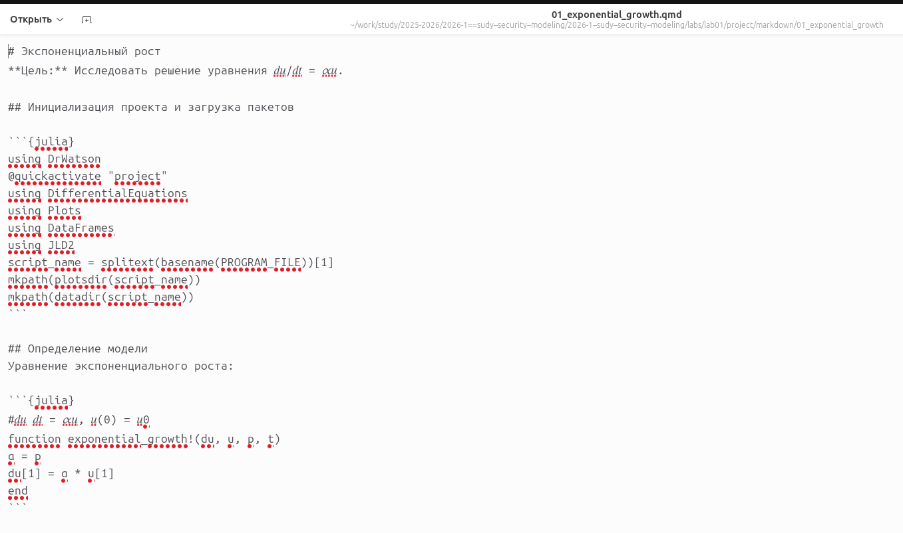
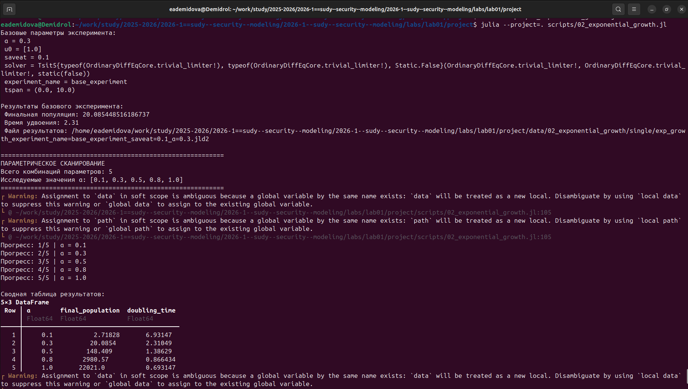
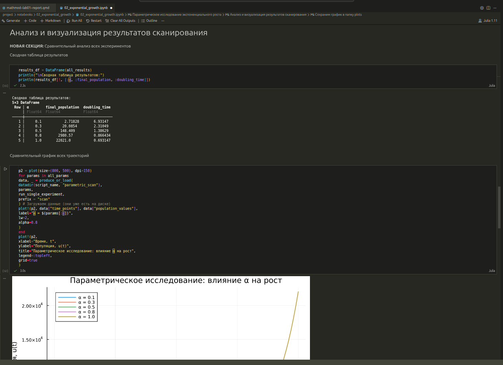

---
## Author
author:
  name: Демидова Екатерина Алексеевна
  degrees: BSc
  orcid: 0000-0002-0877-7063
  email: 1032259377@rudn.ru
  affiliation:
    - name: Российский университет дружбы народов
      country: Российская Федерация
      postal-code: 117198
      city: Москва
      address: ул. Миклухо-Маклая, д. 6

## Title
title: "Лабораторная работа №1"
subtitle: "Основы литературного программирования"
license: "CC BY"
---

# Цель работы

Освоение методологии литературного программирования: создание самодокументируемого кода, его компиляция в исполняемые файлы (чистый код, Jupyter Notebook) и генерация технической документации (Quarto) с возможностью параметризации вычислений.

# Задание

- Создать рабочий каталог для всего курса.
- Создать рабочее пространство для программ в рамках лабораторной работы.
- Выполнить все задания по тексту лабораторной работы.
- Установить необходимые пакеты.
- Выполнить предложенный код.
- Преобразовать код в литературный стиль.
- Сгенерировать из литературного кода:
- чистый код;
- jupyter notebook;
- документацию в формате Quarto.
- Выполнить код из jupyter notebook.
- Интегрировать документацию в формате Quarto в отчёт.
- Добавить в код в литературном стиле вычисление для набора параметров.
- Сгенерировать из литературного кода с параметрами:
- чистый код;
- jupyter notebook;
- документацию в формате Quarto.
- Выполнить код из jupyter notebook с параметрами.
- Интегрировать документацию с параметрами в формате Quarto в отчёт.

# Теоретическое введение

Julia — высокоуровневый свободный язык программирования с динамической типизацией, созданный для математических вычислений.[@julialang]. Эффективен также и для написания программ общего назначения. Синтаксис языка схож с синтаксисом других математических языков, однако имеет некоторые существенные отличия.

Для выполнения заданий была использована официальная документация Julia[@juliadoc].

Экспоненциальный рост — это процесс увеличения величины, при котором скорость роста в каждый момент времени пропорциональна текущему значению этой величины. Чем больше система, тем быстрее она растет [@Samarsci2001].
Экспоненциальный рост — идеализированная модель. В реальности он не может продолжаться бесконечно из-за ограниченности ресурсов (пищи, пространства, капитала и т.д.). После некоторого времени рост обычно замедляется и переходит в логистический рост (S-образная кривая).
# Выполнение лабораторной работы

Для выполнения работы необходимо  создать проект с помощью DrWatson([рис. @fig-001]б [рис. @fig-002]) и установить в него пакеты Julia([рис. @fig-003], [рис. @fig-004])

{#fig-001 width=70%}

{#fig-002 width=70%}

{#fig-003 width=70%}

{#fig-004 width=70%}

Итоговая структура проекта([рис. @fig-005])

{#fig-005 width=70%}

Создадим скрипт scripts/01_exponential_growth.jl, вычисляющий модель экспоненциального роста([рис. @fig-006])

{#fig-006 width=70%}

Также создадим скрипт для генерации проивзодных форматов (scripts/tangle.jl)[рис. @fig-009]. В результате получим код оформленный в разных форматах([рис. @fig-007], [рис. @fig-008])

{#fig-007 width=70%}

{#fig-008 width=70%}

{#fig-009 width=70%}

Исследование не ограничивается одним значением параметров. Изменим программу так, чтобы она принимала набор параметров([рис. @fig-010], [рис. @fig-011]).

{#fig-010 width=70%}

{#fig-011 width=70%}





# Выводы

1. Сформирована структура рабочего пространства, обеспечивающая разделение исходных кодов, данных и документации.  
2. Выполнена интеграция вычислительных экспериментов с их описанием за счёт преобразования кода в литературный стиль.  
3. Автоматизирована генерация артефактов (чистый код, Notebook, отчёт Quarto), что повышает воспроизводимость исследования.  
4. Реализована параметризация расчётов, позволяющая гибко изменять входные данные без модификации основной логики программы.  
5. Итоговая документация объединяет код, результаты вычислений и аналитические выводы, соответствуя принципам открытой науки.

# Список литературы{.unnumbered}

::: {#refs}
:::

