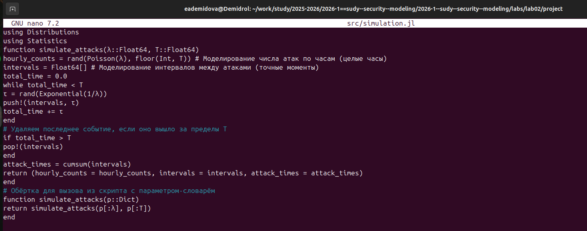

---
# Preamble

## Author
author:
  name: Демидова Екатерина Алексеевна
  degrees: BSc
  orcid: 0009-0005-2255-4025
  email: 1032259377@pfur.ru
  affiliation:
    - name: Российский университет дружбы народов
      country: Российская Федерация
      postal-code: 117198
      city: Москва
      address: ул. Миклухо-Маклая, д. 6
## Title
title: "Лабораторная работа №2"
subtitle: "Основы вероятностного моделирования угроз"
license: "CC BY"
date: 2026-17-02
## Generic options
lang: ru-RU
crossref:
  lof-title: Список иллюстраций
  lot-title: Список таблиц
  lol-title: Листинги
## Formats
format:
### Pdf output format
  beamer:
    toc: false
    toc-title: Содержание
    number-sections: true
    colorlinks: false
    toc-depth: 2
    slide_level: 2
    aspectratio: 169
    section-titles: true
    theme: metropolis
    themeoptions: progressbar=frametitle,sectionpage=progressbar,numbering=fraction
#### Language
    babel-lang: russian
    babel-otherlangs: english
### Html output
  revealjs:
    transition: slide
    margin: 0.2
    smaller: false
    output-ext: html
    theme: beige
    logo: _resources/image/logo_rudn.png
---

# Информация

## Докладчик

:::::::::::::: {.columns align=center}
::: {.column width="70%"}

  * Демидова Екатерина Алексеевна
  * студентка группы НФИмд-01-25
  * Российский университет дружбы народов
  * <https://github.com/eademidova>

:::
::: {.column width="30%"}

:::
::::::::::::::

# Введение

# Цель работы

Освоить базовые методы вероятностного моделирования случайных процессов в контексте кибербезопасности.

# Задачи

1. Создать проект DrWatson с именем project.
2. Определить набор параметров модели (словарь params) с возможностью варьирования.
3. Написать функцию simulate_attacks(params), которая возвращает структуру с результатами симуляции (например, массив числа атак по часам, интервалы, моменты времени).
4. Использовать produce_or_load для запуска симуляции с заданными параметрами и сохранения результатов на диск.
5. Провести серию экспериментов с разными значениями параметров (например, разные $\lambda$, разная длительность).
6. Загрузить сохранённые результаты и выполнить.
7. Проанализировать зависимость точности оценки вероятности от числа симуляций.

# Выполнение лабораторной работы

## Моделирование случайных процессов

Представленные скрипты образуют исследовательский конвейер:

- Моделирование (simulation.jl) — вычислительное ядро.
- Генерация данных (run_experiment.jl) — получение реализаций для фиксированных параметров.
- Анализ и визуализация (analyze.jl) — проверка соответствия модели теоретическим распределениям.
- Исследование сходимости (convergence.jl) — изучение точности оценок.
- Параметрическое исследование (parameter_sweep.jl) — анализ чувствительности к изменению интенсивности

## Моделирование случайных процессов

{#fig-001 width=70%}

## Моделирование случайных процессов

{#fig-002 width=70%}

## Моделирование случайных процессов

{#fig-003 width=70%}

## Моделирование случайных процессов

{#fig-004 width=70%}

## Моделирование случайных процессов

{#fig-005 width=70%}

# Выводы

Создан воспроизводимый пайплайн для симуляции и анализа атак, позволяющий:

* гибко варьировать параметры модели;
* автоматически сохранять и загружать результаты;
* визуализировать и статистически анализировать данные;
* оценивать точность вероятностных прогнозов в зависимости от объёма данных.

# Список литературы

1. JuliaLang [Электронный ресурс]. 2024 JuliaLang.org contributors. URL: https: //julialang.org/ (дата обращения: 11.10.2024).
2. Julia 1.11 Documentation [Электронный ресурс]. 2024 JuliaLang.org contributors. URL: https://docs.julialang.org/en/v1/ (дата обращения: 11.10.2024).
3. Самарский А. А., Михайлов А. П. Математическое моделировамоделирование: Идеи. Методы. Примеры... — М.: Физматлит, 2001.. — 320 с. — ISBN 5-9221-0120-Х.