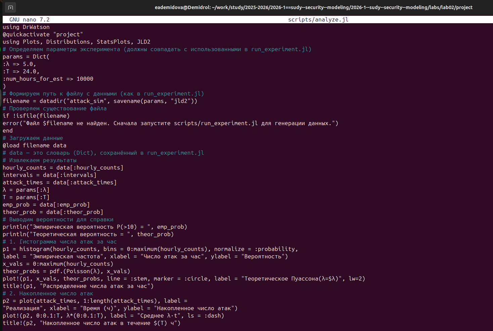
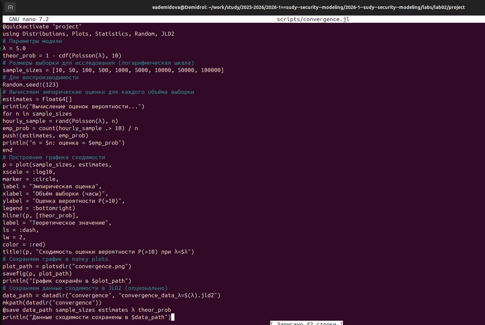
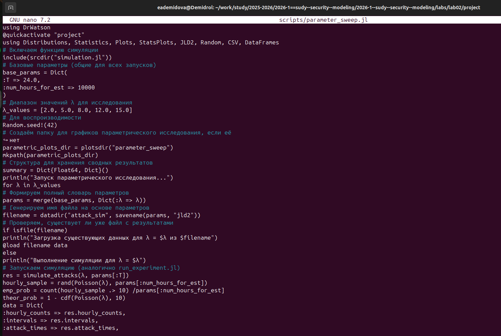

---
# Preamble

## Author
author:
  name: Демидова Екатерина Алексеевна
  degrees: BSc
  orcid: 0009-0005-2255-4025
  email: 1032259377@pfur.ru
  affiliation:
    - name: Российский университет дружбы народов
      country: Российская Федерация
      postal-code: 117198
      city: Москва
      address: ул. Миклухо-Маклая, д. 6
## Title
title: "Лабораторная работа №3"
subtitle: "Моделирование графов атак"
license: "CC BY"
date: 2026-17-02
## Generic options
lang: ru-RU
crossref:
  lof-title: Список иллюстраций
  lot-title: Список таблиц
  lol-title: Листинги
## Formats
format:
### Pdf output format
  beamer:
    toc: false
    toc-title: Содержание
    number-sections: true
    colorlinks: false
    toc-depth: 2
    slide_level: 2
    aspectratio: 169
    section-titles: true
    theme: metropolis
    themeoptions: progressbar=frametitle,sectionpage=progressbar,numbering=fraction
#### Language
    babel-lang: russian
    babel-otherlangs: english
### Html output
  revealjs:
    transition: slide
    margin: 0.2
    smaller: false
    output-ext: html
    theme: beige
    logo: _resources/image/logo_rudn.png
---

# Информация

## Докладчик

:::::::::::::: {.columns align=center}
::: {.column width="70%"}

  * Демидова Екатерина Алексеевна
  * студентка группы НФИмд-01-25
  * Российский университет дружбы народов
  * <https://github.com/eademidova>

:::
::: {.column width="30%"}

:::
::::::::::::::

# Введение

# Цель работы

Освоить методы построения и анализа графов атак для оценки уязвимостей сетевой инфраструктуры.

# Задачи

- Построить граф атак для заданной топологии сети.
- Реализовать алгоритм поиска всех путей от заданного источника к цели.
- Рассчитать метрики центральности для всех узлов и выявить наиболее критичные.
- Визуализировать граф, раскрашивая узлы в зависимости от степени риска.
- Присвоить каждому ребру вес (вероятность успешной атаки) и вычислить наиболее вероятный путь атаки.

# Выполнение лабораторной работы

## Построение графа атак

**Построение графа атак** (`src/attack_graph.jl`) — вычислительное ядро с функциями для построения графа, поиска путей, расчёта метрик центральности и нахождения наиболее вероятного пути.

{#fig-001 width=70%}

## Генерация данных

**Генерация данных** (`scripts/ag_run_experiment.jl`) — построение графа для заданных параметров, поиск путей, расчёт метрик и сохранение результатов в JLD2‑файл.

{#fig-002 width=70%}

## Анализ и визуализация

**Анализ и визуализация** (`scripts/ag_analyze.jl`) — загрузка данных и построение наглядного изображения графа (с цветовой индикацией по PageRank), вывод статистики: количество узлов, рёбер, путей и топ‑5 критичных узлов.

{#fig-003 width=70%}

## Исследование вычислительной сложности

**Исследование вычислительной сложности** (`scripts/ag_convergence.jl`) — изучение зависимости времени поиска путей и их количества от размера сети (числа узлов).

{#fig-004 width=70%}

## Параметрическое исследование

**Параметрическое исследование** (`scripts/parameter_sweep.jl`) — анализ влияния плотности рёбер (вероятности случайного ребра) на количество путей атаки, максимальную входящую степень и среднюю длину пути.

{#fig-005 width=70%}

# Выводы

Разработана модель графа атак с анализом рисков для заданной сети:

* поиск всех путей от источника к цели (алгоритм BFS);
* оценка критичности узлов (метрики in‑degree, PageRank, betweenness);
* визуализация рисков (цветовая схема: красный/жёлтый/зелёный);
* расчёт наиболее вероятного пути атаки (веса рёбер = вероятность успеха).

# Список литературы

1. JuliaLang [Электронный ресурс]. 2024 JuliaLang.org contributors. URL: https: //julialang.org/ (дата обращения: 11.10.2024).
2. Julia 1.11 Documentation [Электронный ресурс]. 2024 JuliaLang.org contributors. URL: https://docs.julialang.org/en/v1/ (дата обращения: 11.10.2024).
3. Самарский А. А., Михайлов А. П. Математическое моделировамоделирование: Идеи. Методы. Примеры... — М.: Физматлит, 2001.. — 320 с. — ISBN 5-9221-0120-Х.