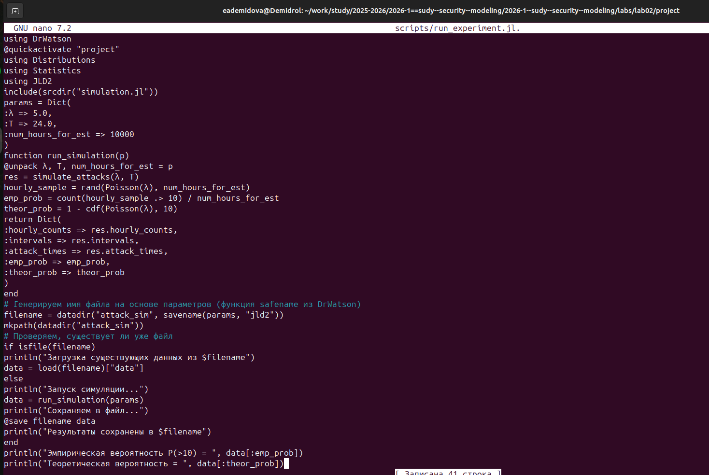

---
## Author
author:
  name: Демидова Екатерина Алексеевна
  degrees: BSc
  orcid: 0000-0002-0877-7063
  email: 1032259377@rudn.ru
  affiliation:
    - name: Российский университет дружбы народов
      country: Российская Федерация
      postal-code: 117198
      city: Москва
      address: ул. Миклухо-Маклая, д. 6

## Title
title: "Лабораторная работа №3"
subtitle: "Основы вероятностного моделирования угроз"
license: "CC BY"
---

# Цель работы

- Освоить методы построения и анализа графов атак для оценки уязвимостей сетевой инфраструктуры.
- На примере моделирования атак на корпоративную сеть изучить:
  - представление сетевой топологии и уязвимостей в виде ориентированного
  графа;
  - алгоритмы поиска всех возможных путей атаки от начальных точек до
  целевых активов;
  - расчёт метрик центральности для определения критических узлов;
  - визуализацию графа с цветовой индикацией уровня риска;
  - оценку вероятности успешной атаки с учётом сложности эксплуатации
  уязвимостей.

# Задание

- Построить граф атак для заданной топологии сети.
- Реализовать алгоритм поиска всех путей от заданного источника к цели.
- Рассчитать метрики центральности для всех узлов и выявить наиболее критичные.
- Визуализировать граф, раскрашивая узлы в зависимости от степени риска.
- Присвоить каждому ребру вес (вероятность успешной атаки) и вычислить наиболее вероятный путь атаки.

# Теоретическое введение

Julia — высокоуровневый свободный язык программирования с динамической типизацией, созданный для математических вычислений.[@julialang]. Эффективен также и для написания программ общего назначения. Синтаксис языка схож с синтаксисом других математических языков, однако имеет некоторые существенные отличия.

Для выполнения заданий была использована официальная документация Julia[@juliadoc].

Экспоненциальный рост — это процесс увеличения величины, при котором скорость роста в каждый момент времени пропорциональна текущему значению этой величины. Чем больше система, тем быстрее она растет [@Samarsci2001].
Экспоненциальный рост — идеализированная модель. В реальности он не может продолжаться бесконечно из-за ограниченности ресурсов (пищи, пространства, капитала и т.д.). После некоторого времени рост обычно замедляется и переходит в логистический рост (S-образная кривая).

# Выполнение лабораторной работы

Для выполнения работы необходимо  создать проект с помощью DrWatson. Затем создадим в этом проекте скрипт src/attack_graph.jl, который содержит cодержит все функции для построения ориентированного графа атак, поиска путей, расчёта метрик центральности, присвоения весов и нахождения наиболее вероятного пути. Это основной модуль, используемый всеми скриптами([рис. @fig-001]).

{#fig-001 width=70%}

Затем создадим скрипт scripts/ag_run_experiment.jl. Он выполняет построение графа атак для заданных параметров, находит все пути, вычисляет метрики центральности, определяет наиболее вероятный путь и сохраняет результаты в JLD2-файл. Предназначен для генерации данных, которые будут анализироваться в других скриптах.([рис. @fig-002]).

{#fig-002 width=70%}

Теперь создадим скрипт scripts/ag_analyze.jl. Он загружает сохранённые данные и строит наглядное изображение графа (с цветовой индикацией по PageRank). Выводит статистику: количество узлов, рёбер, пути, топ-5 критичных узлов по in-degree и PageRank.([рис. @fig-003]). Также добавим скрипт scripts/ag_convergence.jl([рис. @fig-004]). Он позволяет изучить,  как размер сети (число узлов) влияет на время поиска всех путей и на количество найденных путей. Позволяет оценить вычислительную сложность алгоритма.

{#fig-003 width=70%}

{#fig-004 width=70%}

Создадим скрипт scripts/parameter_sweep.jl([рис. @fig-005]). Позволяет систематически изучить, как изменение плотности рёбер (вероятности случайного ребра) влияет на количество путей атаки, максимальную входящую степень и среднюю длину
пути.

{#fig-005 width=70%}

## Контрольные вопросы

**1. Граф атак** — это направленный граф, который представляет все возможные последовательности действий злоумышленника, приводящих его к достижению цели. Вершины графа соответствуют состояниям системы или объектам (например, хостам, сервисам), а рёбра — переходам между состояниями, связанным с эксплуатацией уязвимостей или выполнением определённых действий. Граф строится на основе модели сети, данных об уязвимостях и условиях их эксплуатации, а также информации о топологии сети, правилах доступа и других параметрах. 

**Графы атак используются для:**

* оценки уязвимости сети и анализа защищённости; 
* выявления потенциальных маршрутов атак от точки проникновения до целевой системы;
* расчёта метрик опасности на основе количества уязвимостей, их CVSS-метрик, достижимости и других параметров; 
* определения наиболее критичных уязвимостей и сценариев атак;
* анализа рисков и корреляции предупреждений систем обнаружения атак; 
* расследования компьютерных инцидентов; 
* расчёта контрмер и оптимизации распределения ресурсов для защиты сети. 

**2. Для поиска путей в графах атак применяются различные алгоритмы, например:**

* **Поиск в ширину (BFS, Breadth-First Search).** Находит кратчайший путь до заданной вершины, исследуя все соседние вершины поуровнево.
* **Алгоритм Дейкстры.** Работает на взвешенных графах и находит кратчайший путь от исходной вершины до всех остальных. Вес ребра может отражать сложность или вероятность успешного перехода.
* **A* (A «со звёздочкой»).** Расширение алгоритма Дейкстры с использованием эвристики для ускорения поиска. Учитывает предполагаемую длину пути до цели при выборе следующего шага.
* **Беллмана — Форда.** Подходит для графов с отрицательными весами рёбер, что может быть актуально при учёте некоторых факторов (например, затрат ресурсов атакующего).
* **Флойда — Уоршелла.** Используется для нахождения кратчайших путей между всеми парами вершин, что может быть полезно при анализе сложных сетевых структур.

В контексте атак веса рёбер могут отражать вероятность успеха перехода, сложность эксплуатации уязвимости, стоимость ресурсов для атакующего и т. д.

**3. Метрики центральности** — это показатели, которые агрегируют информацию о взаимном расположении связей и вершин графа и определяют «важность» или «влияние» узла (или кластера узлов) внутри графа. В контексте безопасности они помогают выявить ключевые элементы инфраструктуры, которые наиболее подвержены атакам или играют критическую роль в распространении угроз.

* **In-degree (входящая степень вершины)** — количество рёбер, входящих в узел. В контексте безопасности высокая in-degree может указывать на узел, который часто становится целью атак или является узлом с большим количеством потенциальных векторов проникновения.
* **PageRank** — метрика, которая оценивает относительную важность узлов в графе. Учитывает не только количество связей, но и «важность» узлов, на которые эти связи указывают. В безопасности высокий PageRank может указывать на узлы, которые имеют значительное влияние на распространение угроз или являются ключевыми точками контроля.

**4. Вероятность успешной атаки можно оценить с помощью весов рёбер, если присвоить каждому ребру графа числовое значение, отражающее вероятность успешного перехода между состояниями.** Например, вес ребра может быть равен вероятности того, что злоумышленник сможет эксплуатировать уязвимость или преодолеть защитное средство.

Тогда вероятность успешной атаки по определённому пути будет равна произведению весов всех рёбер, входящих в этот путь. Для поиска наиболее вероятного сценария атаки можно использовать алгоритмы поиска пути с учётом весов, например, модифицированный алгоритм Дейкстры или A*. 

Также можно использовать более сложные модели, например, байесовские графы атак, где каждому узлу присваиваются параметры: локальная вероятность успешной реализации действия, условная вероятность с учётом состояния связанных узлов и полная вероятность с учётом всех возможных состояний.

**5. Ограничения модели графа атак в реальных условиях:**

* **Масштабируемость.** Построение и анализ графов для больших сетей с множеством хостов и уязвимостей может быть вычислительно сложным. Число возможных состояний и путей растёт экспоненциально.
* **Неопределённость данных.** Информация об уязвимостях, конфигурации сети и действиях атакующего часто неполна или неточна. Это затрудняет точное моделирование.
* **Динамичность системы.** Реальные сети постоянно меняются (обновляются ПО, добавляются новые устройства), что требует регулярного обновления графа.
* **Сложность моделирования циклических атак.** Некоторые подходы (например, деревья атак) не поддерживают циклические зависимости.
* **Учёт защитных механизмов.** Стандартные модели графов атак часто не включают динамическое взаимодействие с защитными системами (например, межсетевыми экранами, IDS/IPS), что требует дополнительных расширений.
* **Вычислительные ресурсы.** Анализ больших графов требует значительных вычислительных мощностей, что ограничивает применение в реальном времени.

**6. Чтобы расширить модель графа атак для учёта защитных механизмов (например, межсетевых экранов), можно использовать следующие подходы:**

* **Добавить узлы или рёбра, представляющие защитные меры.** Например, узел «межсетевой экран» может быть связан с узлами сети, которые он защищает, а вес ребра может отражать вероятность блокировки атаки этим средством.
* **Использовать условные рёбра или параметры, зависящие от состояния защиты.** Например, ребро, представляющее атаку, может иметь нулевой вес (или быть удалено из графа), если соответствующий трафик блокируется МЭ.
* **Ввести атрибуты для вершин и рёбер, отражающие характеристики защитных механизмов.** Это могут быть параметры, такие как правила фильтрации, уровень надёжности, задержка обработки трафика и т. д.
* **Использовать вероятностные модели.** Например, можно присвоить вероятность того, что МЭ обнаружит и заблокирует атаку, и учитывать это при расчёте общей вероятности успеха атаки.
* **Интегрировать данные о конфигурации защитных систем.** Например, учитывать правила доступа, логические сегменты сети, созданные МЭ, и их влияние на достижимость уязвимостей.
* **Применить многоуровневые модели.** Например, разделить инфраструктуру на уровни безопасности и моделировать переходы между ними с учётом защитных барьеров.

Также можно использовать расширенные формализмы, такие как байесовские сети или сети Петри, которые позволяют более гибко моделировать динамическое взаимодействие атак и защитных мер.









# Выводы

Разработана модель графа атак с анализом рисков для заданной сети:

* поиск всех путей от источника к цели (алгоритм BFS);
* оценка критичности узлов (метрики in‑degree, PageRank, betweenness);
* визуализация рисков (цветовая схема: красный/жёлтый/зелёный);
* расчёт наиболее вероятного пути атаки (веса рёбер = вероятность успеха).

# Список литературы{.unnumbered}

::: {#refs}
:::

