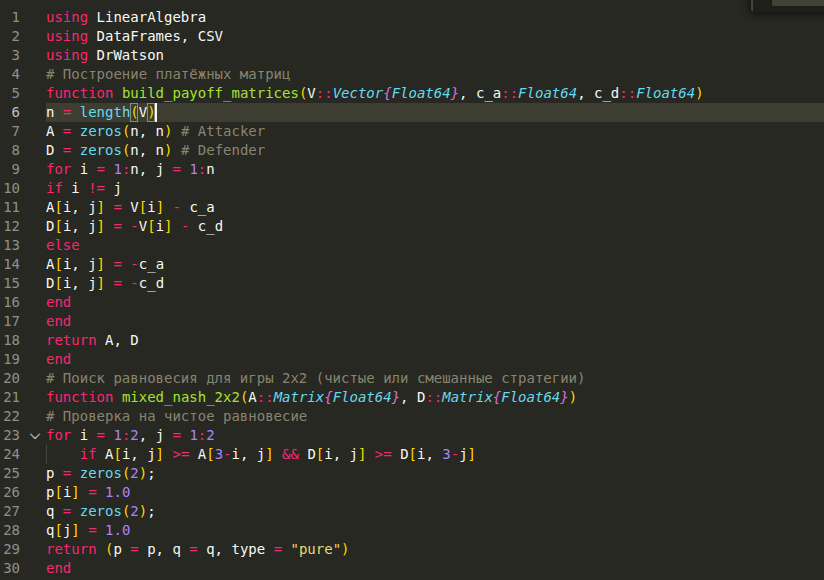
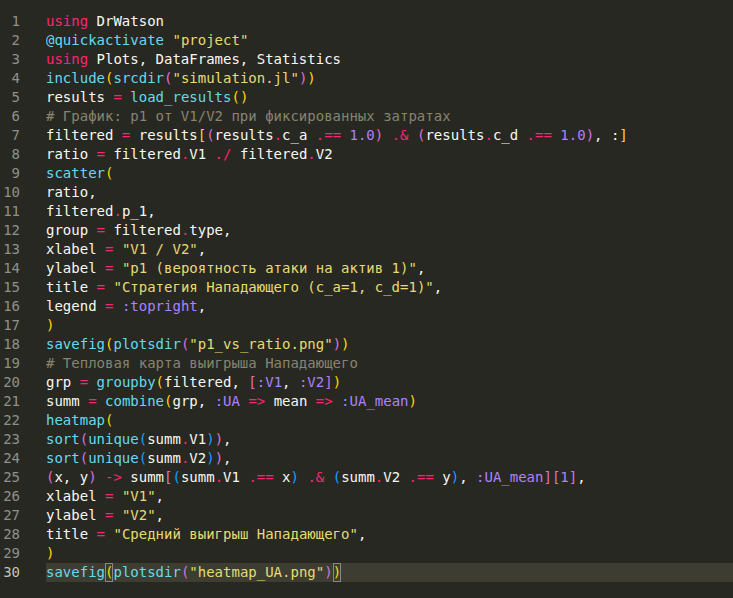

---
# Preamble

## Author
author:
  name: Демидова Екатерина Алексеевна
  degrees: BSc
  orcid: 0009-0005-2255-4025
  email: 1032259377@pfur.ru
  affiliation:
    - name: Российский университет дружбы народов
      country: Российская Федерация
      postal-code: 117198
      city: Москва
      address: ул. Миклухо-Маклая, д. 6
## Title
title: "Лабораторная работа №4"
subtitle: "Моделирование конфликта «Защитник–Нападающий»"
license: "CC BY"
date: 2026-17-02
## Generic options
lang: ru-RU
crossref:
  lof-title: Список иллюстраций
  lot-title: Список таблиц
  lol-title: Листинги
## Formats
format:
### Pdf output format
  beamer:
    toc: false
    toc-title: Содержание
    number-sections: true
    colorlinks: false
    toc-depth: 2
    slide_level: 2
    aspectratio: 169
    section-titles: true
    theme: metropolis
    themeoptions: progressbar=frametitle,sectionpage=progressbar,numbering=fraction
#### Language
    babel-lang: russian
    babel-otherlangs: english
### Html output
  revealjs:
    transition: slide
    margin: 0.2
    smaller: false
    output-ext: html
    theme: beige
    logo: _resources/image/logo_rudn.png
---

# Информация

## Докладчик

:::::::::::::: {.columns align=center}
::: {.column width="70%"}

  * Демидова Екатерина Алексеевна
  * студентка группы НФИмд-01-25
  * Российский университет дружбы народов
  * <https://github.com/eademidova>

:::
::: {.column width="30%"}

:::
::::::::::::::

# Введение

## Цель работы

Освоить применение теории игр для анализа противостояния в сфере информационной безопасности. Научиться строить матричную игру, находить равновесие
Нэша в чистых и смешанных стратегиях.

## Задачи

- Формализовать конфликт «Защитник–Нападающий» в виде антагонистической игры.
- Реализовать на Julia функции расчёта платёжной матрицы, поиска равновесия Нэша и симуляции игры.
- Визуализировать зависимость ожидаемого выигрыша и равновесных вероятностей от стоимости защиты и величины ущерба.

# Выполнение лабораторной работы

## Моделирование конфликта «Защитник–Нападающий»

{#fig-001 width=70%}

## Моделирование конфликта «Защитник–Нападающий»

{#fig-002 width=70%}

## Моделирование конфликта «Защитник–Нападающий»

{#fig-003 width=55%}

## Результаты моделирования конфликта «Защитник–Нападающий»

{#fig-004 width=70%}

## Результаты моделирования конфликта «Защитник–Нападающий»

{#fig-005 width=70%}

# Выводы

На Julia созданы функции расчёта платёжной матрицы, поиска равновесия Нэша и симуляции игры для формализации конфликта «Защитник–Нападающий» в виде антагонистической игры. Визуализированы зависимость ожидаемого выигрыша и равновесных вероятностей от стоимости защиты и величины ущерба

# Список литературы

1. JuliaLang [Электронный ресурс]. 2024 JuliaLang.org contributors. URL: https: //julialang.org/ (дата обращения: 11.10.2024).
2. Julia 1.11 Documentation [Электронный ресурс]. 2024 JuliaLang.org contributors. URL: https://docs.julialang.org/en/v1/ (дата обращения: 11.10.2024).
3. Самарский А. А., Михайлов А. П. Математическое моделировамоделирование: Идеи. Методы. Примеры... — М.: Физматлит, 2001.. — 320 с. — ISBN 5-9221-0120-Х.