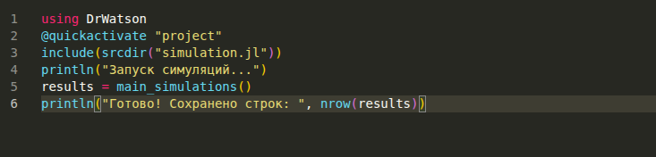

---
## Author
author:
  name: Демидова Екатерина Алексеевна
  degrees: BSc
  orcid: 0000-0002-0877-7063
  email: 1032259377@rudn.ru
  affiliation:
    - name: Российский университет дружбы народов
      country: Российская Федерация
      postal-code: 117198
      city: Москва
      address: ул. Миклухо-Маклая, д. 6

## Title
title: "Лабораторная работа №4"
subtitle: "Моделирование конфликта «Защитник–Нападающий»"
license: "CC BY"
---

# Цель работы

Освоить применение теории игр для анализа противостояния в сфере информационной безопасности. Научиться строить матричную игру, находить равновесие
Нэша в чистых и смешанных стратегиях.

# Задание

- Формализовать конфликт «Защитник–Нападающий» в виде антагонистической игры.
- Реализовать на Julia функции расчёта платёжной матрицы, поиска равновесия Нэша и симуляции игры.
- Визуализировать зависимость ожидаемого выигрыша и равновесных вероятностей от стоимости защиты и величины ущерба.

# Теоретическое введение

Julia — высокоуровневый свободный язык программирования с динамической типизацией, созданный для математических вычислений.[@julialang]. Эффективен также и для написания программ общего назначения. Синтаксис языка схож с синтаксисом других математических языков, однако имеет некоторые существенные отличия.

Для выполнения заданий была использована официальная документация Julia[@juliadoc].

Экспоненциальный рост — это процесс увеличения величины, при котором скорость роста в каждый момент времени пропорциональна текущему значению этой величины. Чем больше система, тем быстрее она растет [@Samarsci2001].
Экспоненциальный рост — идеализированная модель. В реальности он не может продолжаться бесконечно из-за ограниченности ресурсов (пищи, пространства, капитала и т.д.). После некоторого времени рост обычно замедляется и переходит в логистический рост (S-образная кривая).

# Выполнение лабораторной работы

Для выполнения работы необходимо  создать проект с помощью DrWatson. Затем создадим в этом проекте скрипт src/simulation.jl, который который содержит основные функции для симуляции([рис. @fig-001]).

{#fig-001 width=70%}

Затем создадим скрипт scripts/run_sims.jl. Он запускает симуляцию со всеми параметрами.([рис. @fig-002]).

{#fig-002 width=70%}

Теперь создадим скрипт scripts/plot_results.jl для отрисовки графиков по сохраненным результатам симуляции([рис. @fig-003]). 

{#fig-003 width=70%}

Рассмотрим полученные графики([рис. @fig-004],[рис. @fig-005]).

{#fig-004 width=70%}

{#fig-005 width=70%}

Можно сделать следущие выводы:

1. Если **активы почти одинаковы** по ценности → Нападающий атакует случайно (50/50), Защитник тоже случайно защищается → **смешанное равновесие**.
2. Если **один актив заметно дороже** → Нападающий всегда атакует дорогой, Защитник всегда защищает дорогой → **чистое равновесие**.
3. Тепловая карта показывает: в смешанном равновесии выигрыш Нападающего **ниже** (всего ~10–12), чем в чистых углах (~17.5), где он грабит дорогое, а защищают дешёвое.

## Контрольные вопросы

### 1. Что такое антагонистическая игра? Почему модель «Защитник–Нападающий» можно считать игрой с нулевой суммой?

**Антагонистическая игра** — это игра с противоположными интересами, где выигрыш одного игрока равен проигрышу другого. В **игре с нулевой суммой** выполняется $U_A + U_D = 0$, то есть $U_A = -U_D$.

**Почему модель «Защитник–Нападающий» — игра с нулевой суммой?**  
Потому что ресурсы (активы) фиксированы. То, что выиграл Нападающий (украденная ценность), Защитник потерял. Затраты сторон могут быть разными, но в классической постановке общий выигрыш перераспределяется, а не создаётся. Например, если Нападающий похитил актив стоимостью $V$, то его выигрыш $+V$, а выигрыш Защитника $-V$. Это и есть нулевая сумма (без учёта внешних затрат).

### 2. Равновесие Нэша в чистых и смешанных стратегиях. Пример отсутствия чистого равновесия.

**Равновесие Нэша в чистых стратегиях** — ситуация, когда каждый игрок выбирает одно конкретное действие (с вероятностью 1), и никому не выгодно отклоняться в одиночку.

**Равновесие Нэша в смешанных стратегиях** — ситуация, когда игроки случайным образом выбирают действия с некоторыми вероятностями, и никому не выгодно отклоняться (даже к чистым стратегиям). При этом каждому игроку безразлично, какую чистую стратегию выбрать, при условии что другие играют свои смешанные стратегии.

**Пример отсутствия равновесия в чистых стратегиях:**  
Игра «Орёл–Решка» (на деньги):  
- Если Нападающий угадал сторону монеты, он выигрывает 1, иначе проигрывает 1.  
На любую чистую стратегию одного игрока другой отвечает выигрышной чистой стратегией. Поэтому чистого равновесия нет. Равновесие существует только в смешанных стратегиях: каждый бросает монету с вероятностью 0,5.

### 3. Как изменится равновесная стратегия защитника, если ущерб от успешной атаки на незащищённый сервер станет бесконечно большим?

Если ущерб (ценность актива) $V$ стремится к бесконечности для незащищённого сервера, то Защитник будет **с вероятностью 1 защищать этот сервер** (чистая стратегия). Равновесная вероятность защиты $q^*$ для этого актива станет равна 1, если игра допускает чистое равновесие. Если ранее было смешанное равновесие, оно исчезнет: Защитник перестанет рандомизировать. Формально в формуле $q_1^* = \frac{V_2 - c_a}{V_1 + V_2 - 2c_a}$ при $V_1 \to \infty$ получаем $q_1^* \to 1$.

### 4. Зачем в информационной безопасности применяют смешанные стратегии? Реальные примеры рандомизации в защите.

**Зачем:**  
Чтобы сделать поведение **непредсказуемым** для атакующего. Если защита детерминирована, злоумышленник адаптируется и гарантированно обходит её. Рандомизация повышает порог неопределённости и заставляет атакующего тоже смешивать стратегии, снижая его ожидаемый выигрыш.

**Реальные примеры рандомизации в защите:**
- **Ротация портов (port knocking)** — последовательность обращений к закрытым портам заранее неизвестна.
- **Honeypots** — ложные цели развёртываются случайным образом среди реальных систем.
- **Случайное сканирование уязвимостей** — проверка системы в произвольные моменты времени.
- **Рандомизированное логирование (randomized audit)** — аудит не по расписанию, а со случайной задержкой.
- **ASLR (Address Space Layout Randomization)** — случайное размещение исполняемого кода и данных в памяти процесса.







# Выводы

На Julia созданы функции расчёта платёжной матрицы, поиска равновесия Нэша и симуляции игры для формализации конфликта «Защитник–Нападающий» в виде антагонистической игры. Визуализированы зависимость ожидаемого выигрыша и равновесных вероятностей от стоимости защиты и величины ущерба

# Список литературы{.unnumbered}

::: {#refs}
:::

